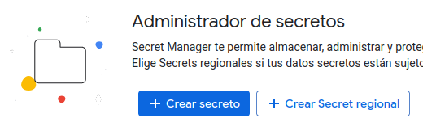

# Google Cloud para un contenedor Docker en la nube

## Pasos:
- **1.** Después de iniciar sesión iremos al apartado "*Consola*", en la parte
superior derecha de la pantalla.

- **2.** Luego, creamos un nuevo proyecto en Google Cloud.

- **3.** A continuación, ya creado, le daremos a "*Implementar una aplicación*".

  

- **4.** En el menú izquierdo, en Descripción General, podemos conectar
con un repositorio GitHub, implementar un contenedor Docker... Le daremos a
"*Implementa un contenedor*".

  

> [!IMPORTANT]  
> Antes de eso deberemos tener las credenciales de Docker en el *Secret Manager*
> de Google Cloud. Para ello nos iremos a la página de 
> [Secret Manager](https://console.cloud.google.com/security/secret-manager?)
> y seleccionaremos nuestro proyecto. A continuación le daremos a *Crear secreto*
> y rellenamos los campos.
> 
> En el campo **Nombre** pondremos ``docker-username`` y en **Valor secreto** 
> escribiremos nuestro nombre de usuario de Docker, y le daremos a *Crear secreto*.
> 
> Tambien tendremos que repetir estos pasos para almacenar la contraseña de Docker
    

    

> Ahora le daremos a *Mostrar panel de información*. En el panel de *Permisos*
> seleccionamos *Añadir principal* (seleccionando los secretos creados previamente)
> y pondremos en *Principales nuevas* por ejemplo nuestro correo de Google Cloud.
> Y en el campo *Rol* le asignaremos ``Administrador de Secret Manager`` y guardamos.

- **5.** A continuación, rellenamos los campos necesarios, URL del contenedor,
Nombre del Servicio... y le damos a *Crear*. Y sería entrar en la URL y listo.