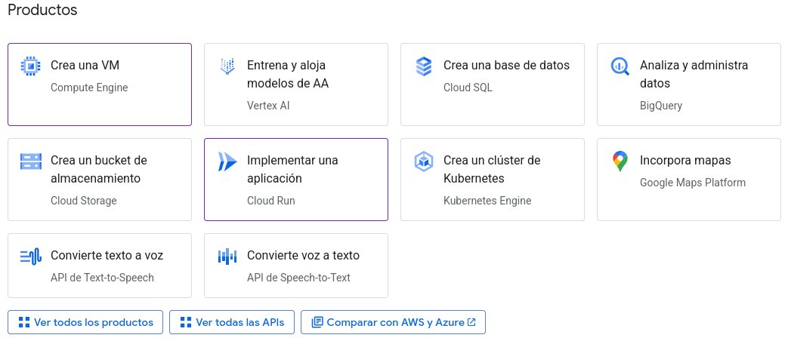
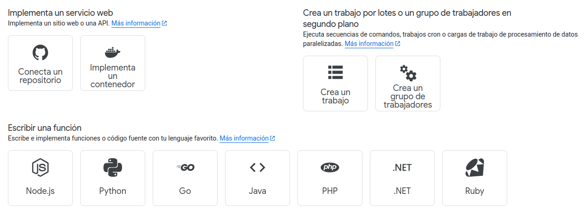
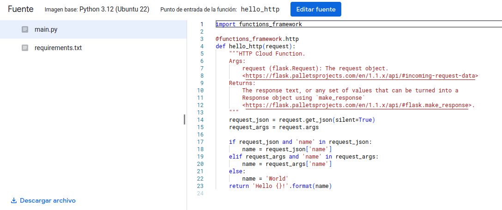

# Google Cloud para un programa Python nativo en la nube

## Pasos:
- **1.** Después de iniciar sesión iremos al apartado "*Consola*", en la parte
superior derecha de la pantalla.

- **2.** Luego, creamos un nuevo proyecto en Google Cloud.

- **3.** A continuación, ya creado, le daremos a "*Implementar una aplicación*".

  

- **4.** En el menú izquierdo, en Descripción General, podemos conectar
con un repositorio GitHub, implementar un contenedor Docker... En este
caso, como se quiere probar un programa simple, iremos al apartado
"*Escribir una función*" en *Python*.

  

- **5.** Ahora, rellenaremos los campos solicitados: Nombre del Servicio,
Autenticación, ... y le daremos a *Crear*

- **6.** Una vez creado, nos saldrá un pequeño programa Hola Mundo que podemos
probar o editar si queremos modificarlo. Le daremos a *Guardar* y
esperaremos a que termine de crearse.

  

- **7.** Al terminar de crearse ya estaría listo para usarse. Podemos entrar en
la URL que nos proporcionan justo encima del código y ver el resultado de
nuestro programa en pantalla.

- **8.** En caso de querer volver a editar el código, le daremos a *Editar
fuente* y guardaremos posteriormente los cambios como antes.

- **9.** También podemos probar el código en el Cloud Shell para ver la salida
del programa sin tener que estar actualizando el servicio cada vez que
hacemos una modificación. Para ello, le daremos a *Probar* en el menú
superior.

  

