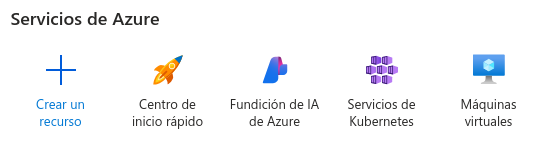

# Azure para un contenedor Docker en la nube

## Pasos:
- **1.** Después de iniciar sesión (en este caso se usará cuenta de
estudiante), le daremos a *Crear un recurso* y seleccionaremos
*Contenedores > Instancias de Contenedores* y le damos a *Crear*.

  

- **2.** Rellenamos los campos necesarios, como el nombre del
contenedor, si queremos crear un contenedor o importar uno... y 
le damos a *Crear*.