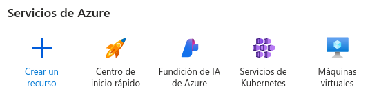
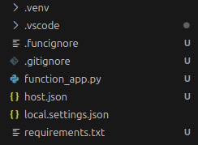

# Azure para un programa Python nativo en la nube

## Pasos:
- **1.** Después de iniciar sesión (en este caso se usará cuenta de
estudiante), le daremos a *Crear un recurso* y seleccionaremos
*Aplicación de funciones*.

  

- **2.** Ahora, rellenamos los campos solicitados, como *Nombre de 
la aplicación, Región, Pila del entorno (en este caso Python)...* y
le damos a *Crear*.

- **3.** Esperamos a que se termine de crear y le damos a *Ir al 
recurso*. Y aquí podemos crear nuestra función Python, desde VS Code
o desde Otros editores o CLI. En este caso usaremos VS Code, para ello
instalaremos la extensión *Azure Functions*.

- **4.** Una vez instalada, le daremos a *Create function* y rellenamos
los campos que nos irán saliendo en pantalla, y se nos desplegará una
nueva ventana. Tendremos que seleccionar una carpeta porque se nos
creará en ella un entorno virtual para la función.

  

- **5.** Una vez creada nuestra función, haremos un *Commit*, y le 
daremos a *Deploy to Azure* y ya estaría todo listo.