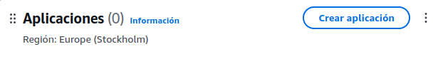

# AWS para un programa Python nativo en la nube

## Pasos:
- **1.** Primero de todo, después de iniciar sesión, le daremos a
*Crear aplicación*

  

- **2.** Ahora rellenamos los campos de *Nombre de la aplicación*, ...
y creamos la aplicación.

Para ello, lo mejor será usar **AWS Lambda** que nos permite ejecutar 
código sin servidor, en respuesta a eventos.